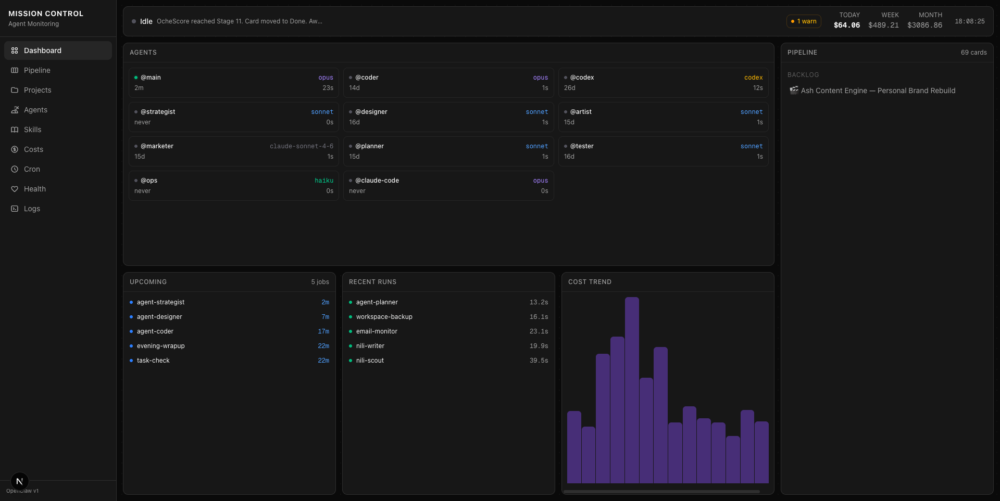
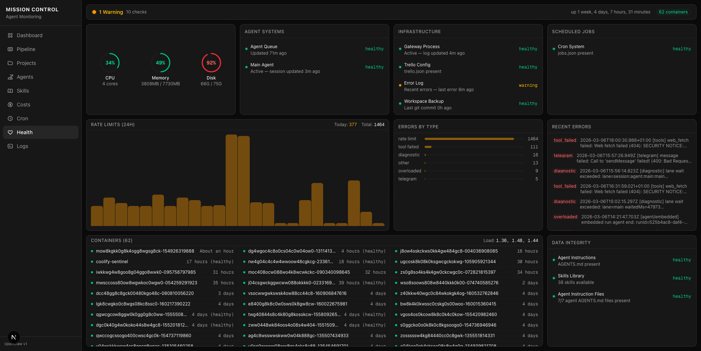

# Mission Control

Real-time monitoring dashboard for autonomous AI agent systems. Built for [OpenClaw](https://github.com/nichochar/openclaw) — tracks agents, costs, pipelines, cron jobs, server health, and more.



## What It Does

Mission Control gives you a single pane of glass over an AI agent fleet:

- **Agent Grid** — Live status of all agents (active/idle), model types, session counts, last activity
- **Cost Tracking** — Daily/weekly/monthly spend with 14-day trend chart, breakdowns by agent and model
- **Pipeline** — Trello-backed kanban view of cards in progress, backlog, review, and done
- **Cron Jobs** — 30+ scheduled jobs with next-run countdowns, run history, durations, and status
- **Health** — CPU/memory/disk gauges, 10+ health checks across categories, rate limit tracking, error breakdown, container monitoring via SSH
- **Projects** — Auto-discovered from `~/Dev/` with framework detection, deploy URLs, git info
- **Skills Library** — Browse all agent skills with full markdown content
- **Agent Profiles** — Deep dive into each agent's role, instructions, pipeline stages, and skills
- **Logs** — Unified timeline of gateway events and cron run history



## Design

Every page uses a **bento grid layout** — no outer scroll, viewport-filling CSS grid with internally scrolling containers. Dark theme with emerald/amber/red status colors.

## Stack

- **Next.js 16** with App Router
- **Tailwind CSS v4** + **shadcn/ui**
- **SWR** for real-time polling
- **Recharts** for cost charts
- **cronstrue** for human-readable cron expressions
- **react-markdown** + **remark-gfm** for rendering agent instructions and skills

## Data Sources

Mission Control reads directly from the OpenClaw filesystem:

| Data | Source |
|------|--------|
| Agent sessions | `~/.openclaw/agents/{name}/sessions/*.jsonl` |
| Agent queue | `~/clawd/memory/state/agent-queue.json` |
| Cron jobs | `~/.openclaw/cron/jobs.json` |
| Cron run history | `~/.openclaw/cron/runs/*.jsonl` |
| Gateway logs | `~/.openclaw/logs/gateway.log` |
| Error logs | `~/.openclaw/logs/gateway.err.log` |
| Agent instructions | `~/clawd/areas/agents/{name}/AGENTS.md` |
| Skills | `~/clawd/skills/{name}/SKILL.md` |
| Server metrics | SSH to remote server (`df`, `free`, `docker ps`, `/proc/loadavg`) |
| Pipeline | Trello API (board/list IDs in `~/clawd/config/trello.json`) |
| Projects | Auto-scan of `~/Dev/` directories |

## Getting Started

### Prerequisites

- Node.js 18+
- pnpm
- An [OpenClaw](https://github.com/nichochar/openclaw) installation with agents configured
- SSH access to your server (for the Health page)
- Trello API credentials (for the Pipeline page)

### Install

```bash
git clone https://github.com/ashtalksai/mission-control.git
cd mission-control
pnpm install
```

### Configure

1. **Agent paths** — Update `src/lib/constants.ts` with your agent names and filesystem paths
2. **SSH host** — Update the SSH target in `src/lib/data/server.ts` (default: `ash-server`)
3. **Trello** — Place your `trello.json` config at `~/clawd/config/trello.json` with `apiKey`, `apiToken`, and list IDs

### Run

```bash
pnpm dev
```

Open [http://localhost:3000](http://localhost:3000).

## Pages

| Route | Description |
|-------|-------------|
| `/` | Dashboard overview — agents, costs, pipeline, cron, cost trend |
| `/pipeline` | Kanban board with Doing/Backlog/Review/Done columns |
| `/projects` | Auto-discovered projects with framework badges and filters |
| `/agents` | Agent team grid with profile cards |
| `/agents/[name]` | Agent profile — instructions, skills, pipeline stages |
| `/skills` | Skills library grid with search and filters |
| `/skills/[name]` | Full skill content rendered as markdown |
| `/costs` | Cost analytics — charts, by-agent/by-model breakdowns, transaction table |
| `/cron` | All cron jobs with schedules, status, run history |
| `/health` | Server gauges, health checks, rate limits, errors, containers |
| `/logs` | Unified log viewer with source filters |

## Architecture

```
src/
  app/              # Next.js App Router pages
  components/       # Shared UI components (sidebar, shadcn)
  hooks/            # usePolling (SWR wrapper)
  lib/
    data/           # Server-side data layer (filesystem reads, SSH, APIs)
    constants.ts    # Paths, agent names, models
    types.ts        # TypeScript interfaces
```

All data fetching happens server-side in API routes. The client polls via SWR at configurable intervals (10s for agents, 5min for costs, etc.).

## License

MIT
