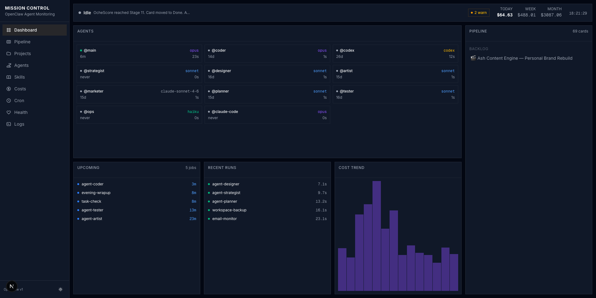
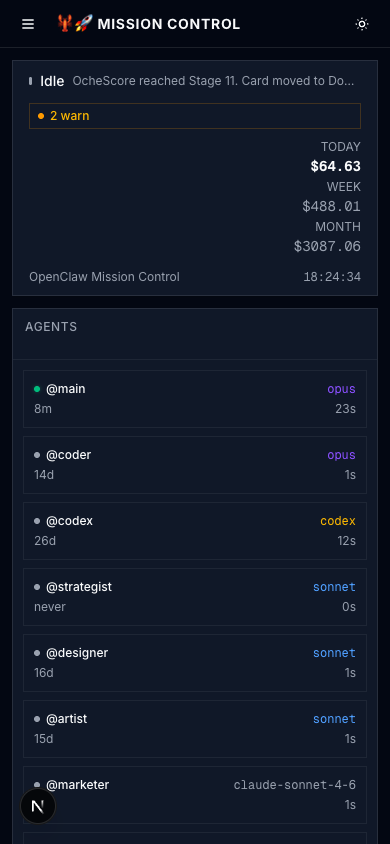

# OpenClaw Mission Control

Real-time monitoring dashboard for autonomous AI agent systems. Built for [OpenClaw](https://github.com/openclaw/openclaw) — tracks agents, costs, pipelines, cron jobs, server health, and more.



## What It Does

Mission Control gives you a single pane of glass over an AI agent fleet:

- **Agent Grid** — Live status of all agents (active/idle), model types, session counts, last activity
- **Cost Tracking** — Daily/weekly/monthly spend with 14-day trend chart, breakdowns by agent and model
- **Pipeline** — Trello-backed kanban view of cards in progress, backlog, review, and done
- **Cron Jobs** — Scheduled jobs with next-run countdowns, run history, durations, and status
- **Health** — CPU/memory/disk gauges, health checks across categories, rate limit tracking, error breakdown, container monitoring via SSH
- **Projects** — Auto-discovered from `~/Dev/` with framework detection, deploy URLs, git info
- **Skills Library** — Browse all agent skills with full markdown content
- **Agent Profiles** — Deep dive into each agent's role, instructions, pipeline stages, and skills
- **Logs** — Unified timeline of gateway events and cron run history



## Features

- **Dark/Light Mode** — Theme toggle with system preference support
- **Responsive** — Mobile-first design with collapsible sidebar, stacked grids on small screens, bento layout on desktop
- **Real-time** — SWR polling at configurable intervals (10s for agents, 30s for cron, 5min for costs)
- **Bento Grid** — Viewport-filling CSS grid on desktop with internally scrolling containers
- **shadcn/ui** — Built with the Vega design system, violet theme, Inter font, hugeicons

## Stack

- **Next.js 16** with App Router
- **Tailwind CSS v4** + **shadcn/ui** (Vega style, violet theme)
- **SWR** for real-time polling
- **Recharts** for cost charts
- **cronstrue** for human-readable cron expressions
- **react-markdown** + **remark-gfm** for rendering agent instructions and skills
- **next-themes** for dark/light mode
- **hugeicons** for iconography

## Important: Custom Setup vs Default OpenClaw

This dashboard was originally built for a **heavily customized** OpenClaw installation. If you're running a default OpenClaw setup, you'll need to adjust the paths. Here's what's different:

### Path Differences

| What | OpenClaw Default | This Project's Setup |
|------|-----------------|---------------------|
| **Workspace root** | `~/.openclaw/workspace` | `~/clawd/` (custom workspace) |
| **Config file** | `~/.openclaw/openclaw.json` | `~/.openclaw/openclaw.json` (same) |
| **Agent sessions** | `~/.openclaw/agents/{id}/sessions/` | `~/.openclaw/agents/{name}/sessions/` (same) |
| **Cron jobs** | `~/.openclaw/cron/jobs.json` | `~/.openclaw/cron/jobs.json` (same) |
| **Cron run history** | `~/.openclaw/cron/runs/{jobId}.jsonl` | `~/.openclaw/cron/runs/{jobId}.jsonl` (same) |
| **Gateway logs** | `~/.openclaw/logs/gateway.log` | `~/.openclaw/logs/gateway.log` (same) |
| **Agent instructions** | `<workspace>/AGENTS.md` (single file) | `~/clawd/areas/agents/{name}/AGENTS.md` (per-agent files in custom dir) |
| **Skills** | `<workspace>/skills/` or `~/.openclaw/skills/` | `~/clawd/skills/` (custom workspace path) |
| **Identity/Soul** | `<workspace>/SOUL.md` | `~/clawd/IDENTITY.md` (renamed) |
| **Agent queue** | Not a default OpenClaw feature | `~/clawd/memory/state/agent-queue.json` (custom state management) |
| **Trello config** | Not part of OpenClaw | `~/clawd/config/trello.json` (custom pipeline integration) |

### Feature Differences

| Feature | OpenClaw Default | This Setup |
|---------|-----------------|------------|
| **Number of agents** | 1 (single `main` agent) | 11 specialized agents (coder, designer, marketer, ops, etc.) |
| **Pipeline tracking** | None | Trello board integration with kanban view |
| **Server monitoring** | None | SSH-based monitoring of a remote VPS (CPU, memory, disk, Docker containers) |
| **Agent queue** | None | Custom queue system tracking which agent is working on which card |
| **Per-agent instructions** | Single `AGENTS.md` in workspace | Separate `AGENTS.md` per agent in dedicated directories |
| **Cost tracking** | None | Reads session JSONL files to calculate API costs |
| **Rate limit tracking** | None | Parses error logs for rate limit events |

### What You Need to Adapt

If you're setting this up for your own OpenClaw installation:

1. **`src/lib/constants.ts`** — This is the main file to edit:
   - `AGENT_NAMES` — Update with your agent IDs (check `~/.openclaw/agents/`)
   - `AGENT_MODELS` — Map agent names to their model types
   - `PATHS` — Update any custom paths (agent queue, etc.)

2. **`src/lib/data/agent-profiles.ts`** — If you use default OpenClaw, your `AGENTS.md` is at `<workspace>/AGENTS.md` not in per-agent dirs. Update `AGENTS_DIR` path.

3. **`src/lib/data/skills.ts`** — Update `SKILLS_DIR` to match your skills location (`~/.openclaw/skills/` or `<workspace>/skills/`).

4. **`src/lib/data/server.ts`** — SSH monitoring requires:
   - A server with SSH key auth configured
   - Update the hostname in the `ssh()` function (default: `ash-server`)
   - If you don't have a VPS, you can disable the Health page or modify it to show local system stats

5. **`src/lib/data/pipeline.ts`** — Trello integration requires:
   - A `trello.json` config with `apiKey`, `apiToken`, and board list IDs
   - If you don't use Trello, you can replace this with any task management API or disable the Pipeline page

6. **`src/lib/data/health.ts`** — Health checks reference custom paths. Update the file paths to match your installation.

### Quick Start for Default OpenClaw

If you're running a standard single-agent OpenClaw setup:

```bash
# These paths should work out of the box:
~/.openclaw/agents/main/sessions/  # Agent sessions (costs)
~/.openclaw/cron/jobs.json          # Cron jobs
~/.openclaw/cron/runs/              # Cron run history
~/.openclaw/logs/gateway.log        # Gateway logs

# These need to be configured:
# 1. Update AGENT_NAMES in constants.ts to just ["main"]
# 2. Update skills path to ~/.openclaw/skills/ or your workspace/skills/
# 3. Disable or modify server SSH monitoring
# 4. Disable or replace Trello pipeline integration
```

## Getting Started

### Prerequisites

- Node.js 18+
- pnpm
- An [OpenClaw](https://github.com/openclaw/openclaw) installation with agents configured

### Optional (for full features)

- SSH access to your server (Health page — server monitoring)
- Trello API credentials (Pipeline page)
- Multiple agents configured (Agents page)

### Install

```bash
git clone https://github.com/ashtalksai/mission-control.git
cd mission-control
pnpm install
```

### Configure

1. **Agent paths** — Edit `src/lib/constants.ts` with your agent names and paths
2. **SSH host** — Edit `src/lib/data/server.ts` if you have a VPS to monitor
3. **Trello** — Add `trello.json` config if you use Trello for pipeline tracking
4. **Skills** — Update `src/lib/data/skills.ts` `SKILLS_DIR` to your skills location

### Run

```bash
pnpm dev
```

Open [http://localhost:3000](http://localhost:3000).

## Pages

| Route | Description |
|-------|-------------|
| `/` | Dashboard overview — agents, costs, pipeline, cron, cost trend |
| `/pipeline` | Kanban board with Doing/Backlog/Review/Done columns |
| `/projects` | Auto-discovered projects with framework badges and filters |
| `/agents` | Agent team grid with profile cards |
| `/agents/[name]` | Agent profile — instructions, skills, pipeline stages |
| `/skills` | Skills library grid with search and filters |
| `/skills/[name]` | Full skill content rendered as markdown |
| `/costs` | Cost analytics — charts, by-agent/by-model breakdowns, transaction table |
| `/cron` | All cron jobs with schedules, status, run history |
| `/health` | Server gauges, health checks, rate limits, errors, containers |
| `/logs` | Unified log viewer with source filters |

## Architecture

```
src/
  app/              # Next.js App Router pages + API routes
  components/       # Shared UI (sidebar, theme, shadcn)
  hooks/            # usePolling (SWR wrapper)
  lib/
    data/           # Server-side data layer (filesystem reads, SSH, APIs)
    constants.ts    # Paths, agent names, models — EDIT THIS FIRST
    types.ts        # TypeScript interfaces
```

All data fetching happens server-side in API routes under `src/app/api/`. The client polls via SWR at configurable intervals defined in `src/lib/constants-client.ts`.

## Contributing

Contributions welcome! Some ideas:

- [ ] Per-project cost tracking (associate API costs with Trello cards)
- [ ] Support for other task managers (Linear, GitHub Projects, Asana)
- [ ] Local system monitoring (no SSH required)
- [ ] Notification system (alerts when health checks fail)
- [ ] Historical cost charts (beyond 30 days)

## License

MIT
